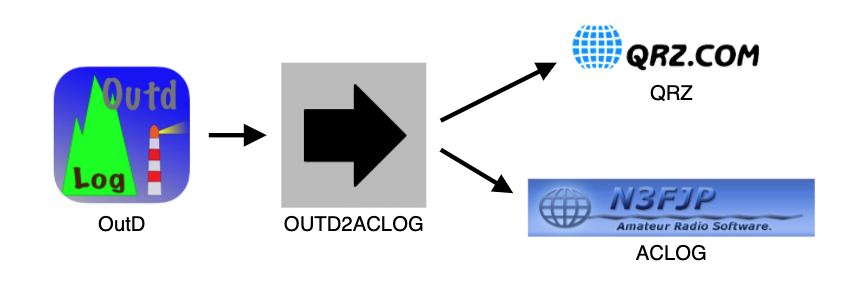
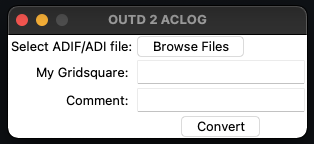

# OUTD-2-ACLOG

This project originally started out as a useful tool for converting OutD (SOTA logging iPhone app) ADIF files to ACLOG (N3FJP logging software) ADI log files. At the time, there were some compatibility issues with importing OutD log files to ACLOG, so the app made sense, but now days those issues have been resolved. OUTD2ACLOG is now used to autogenerate/autofill `COMMENT` and `MY_GRIDSQAURE` fields for both OutD and HAMRS ADIF log files. The modified log files can then be imported to ACLOG (N3FJP) or qrz.com. Needless to say, this program is highly customized for a very specific use case... and user. Feel free to modify program to match your own logging needs or just as-is!



## How it works



<h3>Steps:</h3>

1. Click "Browse Files" and select the OutD or HAMRS ADIF log file
2. Enter your gridsquare in the "My Gridsquare" field for OutD log files. Note: This field is ignored if the log file type is HAMRS. The HAMRS app automatically populates the MY_GRIDSQUARE field.
3. The "Comment" field works in three different ways <br>
    * If you write anything in this field, outd2aclog will overwrite all COMMENT fields in the ADI with the value entered. <br>
    * If you enabled OutD QSPMSG, leaving this field blank will convert all QSPMSG fields to COMMENT fields in the ADI. <br>
    * If you disabled OutD QSPMSG, leaving this field blank will auto-generate a comment with the following format: <br>
        * SOTA Activator log entry: "SOTA \[my summit reference\]" <br>
        * SOTA Chaser log entry "SOTA CHASE \[other summit reference\]" <br>
        * SOTA S2S log entry: "SOTA \[summit reference\] - S2S - \[other summit reference\]" <br>
4. Click the "Convert" button to create the converted log file! Note: Outd2aclog will generate a new ADI log file which follows the naming convention of the original OutD filename (i.e. - "OutdLog-YYYYMMDD.adif" will generate "ACLOG-YYYYMMDD.adi")

## Build Dependencies

OUTD-2-ACLOG is typically used on Windows machines since ACLOG is a Windows-only program, but can run on any machine which supports Python.

1. [Python](https://www.python.org/downloads/)
2. [Pip](https://pip.pypa.io/en/stable/installing/)
3. Tkinter
4. Tkmacosx

```shell
pip install -r requirements.txt
```

4. (OPTIONAL) To build an executable you will need [Pyinstaller](https://www.pyinstaller.org/downloads.html)

```shell
pip install -r requirements-build.txt
```

## Run

As a Script:

```shell
python launch.py
```

As a Python Module:

```shell
python -m outd2aclog
```

## Build Executable (Mac, Windows, Linux)

Easy mode:

```shell
python setup.py build
```

Manual build:

```shell
pyinstaller --name outd2aclog --onefile --noconsole --add-data outd2aclog\static\*;outd2aclog\static\ --icon outd2aclog\static\outd2aclogicon.ico launch.py
```
