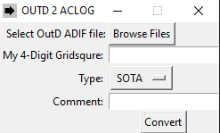

# OUTD-2-ACLOG

Converts OutD ADIF log files to ACLOG (N3FJP) ADIF parsable log files



## Build Dependencies

OUTD-2-ACLOG is typically used on Windows machines since ACLOG is a Windows-only program, but it can run on any machine
which supports Python.

1. [Python](https://www.python.org/downloads/)
2. [Pip](https://pip.pypa.io/en/stable/installing/)
3. Tkinter

```shell
pip install -r requirements.txt
```

4. (OPTIONAL) To build an exe you will need [Pyinstaller](https://www.pyinstaller.org/downloads.html)

```shell
pip install -r requirements-build.txt
```

## Run

As a Script:

```shell
python launch.py
```

As a Python Module:

```shell
python -m outd2aclog
```

## Build Window EXE

Easy mode:

```shell
python setup.py build
```

Manual build:

```shell
pyinstaller --name outd2aclog --onefile --noconsole --add-data outd2aclog\static\*;outd2aclog\static\ --icon outd2aclog\static\outd2aclogicon.ico launch.py
```
