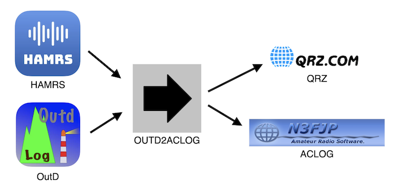

# OUTD-2-ACLOG

Converts OutD ADIF log files to ACLOG (N3FJP) or qrz.com ADI parsable log files.



## How it works


Steps:
1. Click "Browse Files" and select the OutD ADIF log file
2. Enter your 4 digit gridsquare in the "My 4-Digit Gridsquare" field
3. The "Comment" field works in three different ways
    a. If you write anything in this field, outd2aclog will overwrite all COMMENT fields in the ADI with the value entered.  
    b. If you enabled OutD QSPMSG, leaving this field blank will convert all QSPMSG fields to COMMENT fields in the ADI.
    c. If you disabled OutD QSPMSG, leaving this field blank will auto-generate a comment with the following format:
        SOTA Activator log entry: "SOTA \[my summit reference\]"
        SOTA Chaser log entry "SOTA CHASE \[other summit reference\]"
        SOTA S2S log entry: "SOTA \[summit reference\] - S2S - \[other summit reference\]"


## Build Dependencies

OUTD-2-ACLOG is typically used on Windows machines since ACLOG is a Windows-only program, but it can run on any machine
which supports Python.

1. [Python](https://www.python.org/downloads/)
2. [Pip](https://pip.pypa.io/en/stable/installing/)
3. Tkinter
4. Tkmacosx

```shell
pip install -r requirements.txt
```

4. (OPTIONAL) To build an executable you will need [Pyinstaller](https://www.pyinstaller.org/downloads.html)

```shell
pip install -r requirements-build.txt
```

## Run

As a Script:

```shell
python launch.py
```

As a Python Module:

```shell
python -m outd2aclog
```

## Build Executable (Mac, Windows, Linux)

Easy mode:

```shell
python setup.py build
```

Manual build:

```shell
pyinstaller --name outd2aclog --onefile --noconsole --add-data outd2aclog\static\*;outd2aclog\static\ --icon outd2aclog\static\outd2aclogicon.ico launch.py
```
